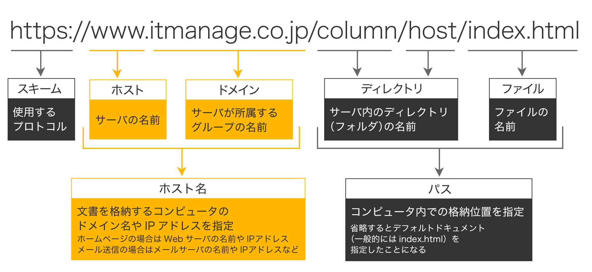

# 第5回課題

## ・URLとは

URLの構成は上記となっており、ディレクトリ以下はパスと言う。
ホスト名+ドメイン名をFQDNと言い、これをドメイン名とも言う事があり混乱を招く事があるので注意。
DNSでドメインからネットワークを探す→ホストからホストPCを探す→ディレクトリからPC内のフォルダ階層を探す→
ファイル名からファイルを指定し実行するというのが基本的なインターネットでのクライアント側からの
リクエストの一連の流れ

※[参考URL](https://www.itmanage.co.jp/column/host-name/)

## ・クエリ文字とは 

「?」をURLの末尾につけ、その次に「パラメーター＝値」をつける、複数つけたい場合は「&」で繋いで付ける。
これによりサーバーへ送信したいデータをURLに付け加える事ができる。(ログインIDやパス、
フォーマットへ入力した文字情報、検索したい文字情報等)

## ・パス変数とは 

「URLとは」で書いた通り、URLのディレクトリ以下の事。

## ・クエリ文字列とパス変数の違い 

PCのフォルダでの操作に例えると、ツリー(階層)から場所を指定して情報を見つける方法がパス変数、
検索窓から条件を入れて検索して見つける方法がクエリ文字列。

## ・HTTPメソッドとは 

HTTPリクエストの一番最初、リクエスト行に記述されリクエスト内容の大まかな概要を示す。以下一例。

| 　メソッド　 | 意味                                      | 
|--------|-----------------------------------------| 
| GET    | サーバー上のリソース本体を取り出す                       | 
| POST   | サーバー上にリソースを作成する                         | 
| PUT    | サーバー上のリソースに全体上書き(置換)、無い場合は作成する          | 
| PATCH  | サーバー上のリソースの一部修正、全体作用しないので間違った上書きをしにくくなる | 
| DELETE | サーバー上のリソースを削除する                         | 

## ・リクエストヘッダーとは 

受け取るコンテンツタイプや接続状況、クライアント側の情報があり、要求について細かい条件を示すものが多くを占める。

## ・HTTPステータスコードとは 

レスポンス行で表示される3桁の番号。リクエストに対してどのような結果になったかを表す。下記は一例。

| ステータスコード | 意味                   | 
|----------|----------------------| 
| 200      | リクエストが正常に処理できた       | 
| 201      | リクエストが成功してリソースの作成が完了 | 
| 400      | 一般的なクライアントエラー        | 
| 404      | Webページが見つからない        | 
| 500      | 何らかのサーバ内で起きたエラー      | 

## ・レスポンスヘッダーとは 

レスポンスに付加される制御情報でWebアプリケーションのパフォーマンスの最適化を担っている。
例えば、Cache-Controlヘッダーを使用して、クライアント側でのキャッシュ動作を制御したり、
Expiresヘッダーを使用して、リソースの有効期限を指定できる。適切なキャッシュ制御によりデータ転送量を減らし、
レスポンス時間を短縮できる。

## ・レスポンスボディとは 

リクエストに対して送られてきたデータの本体。JSON、XML、画像、ファイル等の形式が一般的。
画像付きのHTML等の場合は一度目のレスポンスでHTMLが届き、ニ度目のレスポンスで画像が届く。
基本的に1リクエストにつき1リソースとなる。

## ・JSONとは 

JavaScriptのオブジェクト記法で定義されたデータ形式。そのため、そのままJavaScriptのオブジェクトとして
扱う事ができるので、JavaScriptとの親和性が高い。比較的に軽量かつ人にとって読みやすい形式である。

## ・JSON表現例 

{
"name": "jon",
"job": "Leader",
"id": "001",
"createdAt": "2024-05-20T11:00:28.107Z"
"contact details": {
"phone”:”8439743294793",
"email":"test@abc.com"
}
}
